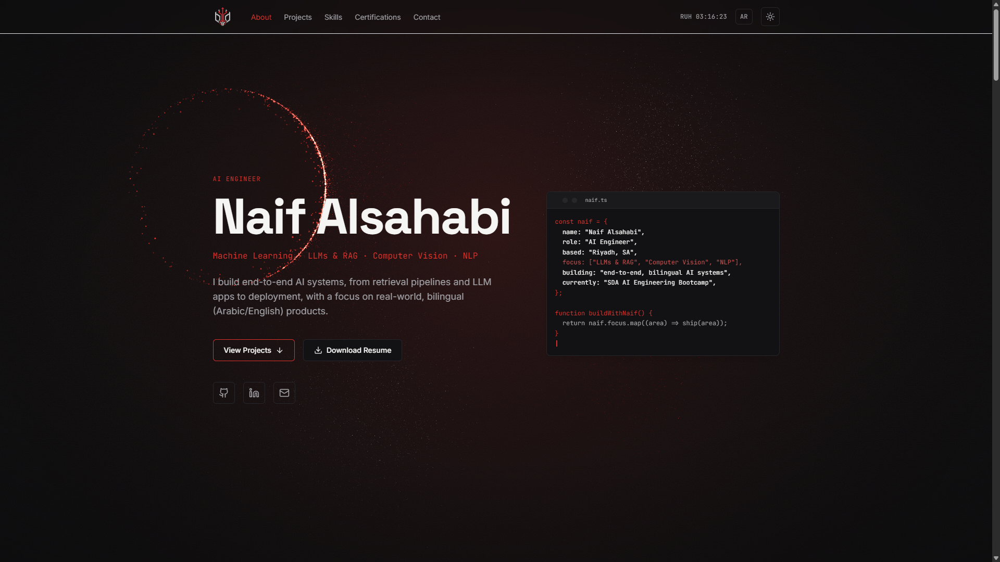

# Naif Alsahabi — Portfolio

Personal portfolio for an AI Engineer: projects, skills, certifications, and contact — built with React, Vite, TypeScript, Tailwind CSS, Framer Motion, and GSAP.



> Add a screenshot at `docs/screenshot.png` after your first deploy.

## Tech stack

- React 18 + TypeScript
- Vite
- Tailwind CSS v3.4
- Framer Motion + GSAP (ScrollTrigger-ready intro)
- lucide-react icons
- Formspree (contact form)

## Requirements

- **Node.js 20+** (recommended: use [nvm](https://github.com/nvm-sh/nvm))

```bash
nvm install 20 && nvm use 20
node -v   # should print v20.x or higher
```

## Edit your content

Update **only** these files — the rest of the site reads from them:

| File | What to edit |
|------|----------------|
| `src/data/profile.ts` | Name, bio, education, social links, email |
| `src/data/projects.ts` | Projects, tech stacks, repo/live URLs |
| `src/data/skills.ts` | Skill groups |
| `src/data/certifications.ts` | Certifications |
| `public/resume.pdf` | Your CV download |
| `src/components/Contact.tsx` | Replace `YOUR_FORM_ID` with your [Formspree](https://formspree.io/) form ID |

## Local development

```bash
npm install
npm run dev
```

Open the URL Vite prints (usually `http://localhost:5173/Portfolio/`).

```bash
npm run build    # production build → dist/
npm run preview  # preview the built site
```

## Deploy to GitHub Pages

This repo is configured for **`Naifcx47350/Portfolio`**:

- **Live URL:** [https://naifcx47350.github.io/Portfolio/](https://naifcx47350.github.io/Portfolio/)
- **Vite base path:** `/Portfolio/` (see `vite.config.ts`)

### One-time setup

1. Push this repo to GitHub (`main` branch).
2. Go to **Settings → Pages → Build and deployment**.
3. Set **Source** to **GitHub Actions**.
4. On push to `main`, the workflow in `.github/workflows/deploy.yml` builds and deploys automatically.

### Using a user site instead

If you rename the repo to `Naifcx47350.github.io`, change `base` in `vite.config.ts` to `'/'` for a clean root URL.

This is a single-page app with anchor navigation — no SPA 404 redirect is needed.

## License

See [LICENSE](./LICENSE).
